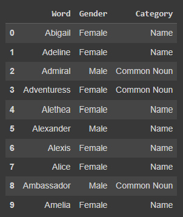
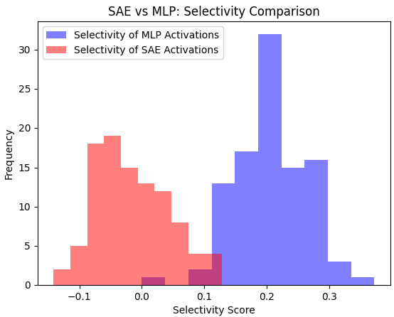
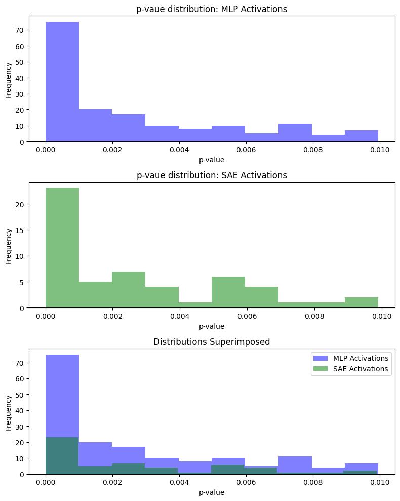

# MATS Application

Google Colab Link [here](https://colab.research.google.com/drive/1\_hvruCSTxb9NprC7HTJpkTr\_aL65R2Fk?usp=sharing) for the project.

# Introduction and Objective

Sparse Autoencoders (SAEs) are a promising area in interpretability research. Superposition and polysemanticity emerge as two big hurdles in developing a clear and reliable understanding of what goes inside Deep Neural Networks. Training SAEs (with squared error) is a step towards lifting these hurdles and making models more transparent.

The hidden layer of a deep learning model packages all features of the training dataset into *d* dimensions. In the case of most Language Models (LMs), the set of encoded features is much larger than the dimensions available to the model. The model, therefore, learns to encode those features as a set of non-privileged bases. An SAE seeks to project this *d-dimensional* encoding into an even higher dimensional space (*f*) while also enforcing sparsity. The intention is to extract a set of orthogonal privileged bases from the non-privileged ones in *d* dimensions. A feature direction in *d* dimensions would be a linear combination of *d* basis vectors. In the case of the SAE, the same feature should be represented by a single (or a few) neuron(s). The result is that there is better localization of the feature to a small set of neurons.

A good SAE must lead to better feature localization with minimal loss of ability to predict the feature label. This research uses Linear Probing and Statistical Inference to understand SAE activations and how they differ from the MLP activations of the underlying model. The idea is to observe feature localization to a small set of neurons and determine whether that small set can predict the feature label as well as the MLP’s inner representation. The ultimate objective is to design metrics that measure the effectiveness of an SAE.

The **objectives** of this study can be summarized as:

1. Assess whether SAE activations are more localized than MLP activations with respect to a feature.  
2. Assess whether a subset of SAE activations predict the feature label almost as well as the MLP activations. In other words, determine the information loss between the MLP and SAE.  
3. Achieving Objectives 1 and 2 will help design a metric that measures the effectiveness of an SAE by considering both localization and the ability to predict the target feature.

# Experiments

## Outline

1. Generating a gender-labeled dataset. For more information, refer to the Dataset sub-section.  
2. Computing MLP activations from Tiny Stories 21M using the gender dataset. The activations are computed for each word separately, without providing any other context.   
3. Training SAE on the model’s MLP layer.  
4. Computing SAE activations using the gender dataset.  
5. Linear Probing on MLP and SAE activations.  
6. Training a Logistic Regression model to predict the gender label using SAE and MLP activations.  
7. Performing 2 sample t-test on neuron activations to identify neurons that vary for the two genders under study.

## Dataset

To analyze SAE and MLP activations, I use a gender-labeled dataset of 312 words and their associated gender. For simplicity, this project focuses on two genders: male and female; and the proper nouns (names) and common nouns associated with those genders. This is a synthetic dataset generated by Llama 2.1 70B. Prompts can be found in Annexure 1\. The raw dataset (without manual screening) and the final cleaned dataset can be found [here](https://docs.google.com/spreadsheets/d/1L0JCMSMpNwzrEl4rMzJTISaAKS764ow-/edit?usp=sharing\&ouid=115140452905376605087\&rtpof=true\&sd=true).

*A peek into the dataset*

## Training the SAE

The SAE was trained on the MLP layer of the only transformer block of Tiny Stories 21M. The SAE was trained on a tokenized dataset from Hugging Face using 30,000 training steps on a single NVIDIA-A10.

## Linear Probing

Linear Probing is an interpretability technique used to analyze the internal representation of neural networks. It usually involves training a supervised model to predict the feature label (gender label in our case) using the inner representation of the model. This is helpful in determining whether or not the inner representation contains an encoding for the given feature. 

A major problem with this approach is that the linear probe (supervised model) can end up memorizing the mapping from the representation to the label (overfitting the training sample) and giving a false impression that the inner representation contains the feature encoding. To overcome this problem, a control task is carried out where the target feature labels are randomly assigned while maintaining the ground truth class frequencies. The selectivity metric is then calculated as the difference between the accuracy of the linear probe and that of the control task to ascertain whether high probing accuracy is from the presence of the feature encoding or from memorization. In our case, the selectivity metric of the MLP activations and that of the SAE activations are compared to determine whether they contain the feature encoding. This helps in fulfilling Objective 2\.

## Logistic Regression

The idea behind using activations to predict feature labels using logistic regression is to analyze the statistical significance of individual neurons in predicting the target feature. When comparing the significance of neurons for the SAE to that of the MLP, one would expect to find a smaller number of statistically significant neurons in the SAE, explaining most of the variance in the target feature. With sufficient regularization, most of the neurons in the SAE would be discarded from the optimized model. This helps in assessing Objective 1\.

It would also be worthwhile to compare the accuracy of both models (SAE activations and MLP activations). A significant deviation in accuracy/error would hint at information loss while training the SAE. This can be another good method for estimating the effectiveness of the SAE. This is a step in the direction of Objective 2\.

## Neuron-wise t-test

An alternative method to identify the neurons that fire differently for the two genders under study would be to find neurons (separately for MLP and SAE) whose activations are statistically different for the two genders. In other words, we would perform a 2 sample t-test to check whether the mean of the neuron activations varies significantly across the two genders. We would perform this separately for the MLP and SAE and analyze how they differ.

This is an indirect and much less rigorous way (statistically) of determining important neurons. At a high level of significance, we would expect fewer SAE neurons (than MLP neurons) to meet the criteria. This experiment can help with Objective 1\. For this study, we set the significance level at 99.999%.

# Results

## Linear Probing of SAE vs MLP Activations

The size of the dataset is a major hurdle to the Linear Probing task. Owing to the large embedding dimensions, and low sample count, the probe ends up memorizing the mapping. Despite a poor selectivity score for both the MLP and SAE activations, the MLP activations have consistently higher selectivity, implying that the SAE fails to capture the feature correctly. The selectivity metric is computed across several control tasks (each task representing a different random class assignment).

 
For the given dataset, the MLP Selectivity is higher, implying that the SAE is poorly trained (as evidenced by the given feature). A typical test for the effectiveness of the SAE would be to test this metric on a set of defined features.

## Logistic Regression \- Failed to converge

The logistic regression failed to converge, most likely because of the small size of the dataset (312)  in comparison to the number of feature dimensions (1024 for the MLP and 16384 for the SAE).

## Neuron-wise t-test

At 99.999% significance level, 9 MLP neurons and 2 SAE neurons were significant. Those neurons are listed in Annexure 2\. Here is the distribution of the p-values for the difference between neuron activations for the two genders.

The distributions confirm our original hypothesis. It is very evident that in the case of the SAE, fewer neurons yield statistically significant results (more localization). The shorter height of the SAE histogram in comparison to the MLP histogram allows us to arrive at that conclusion without setting any confidence level per neuron. Although this indicates better feature localization, it doesn't confirm whether there is any loss of information. This result helps with Objective 1 but not with Objective 2\.

# Shortfalls

1. The dataset is generated by prompting Llama 3.1 70B. The gender encoding for this model significantly differs from that of Tiny Stories 21M. Although the words were manually inspected, there are some words that can be considered gender-agnostic. This may interfere with the results of the experiments.  
2. The dataset size (312 samples) is quite small in comparison to the embedding space of 1024 for the MLP and 16348 for the SAE. This poses a challenge in training feature-label predictors using activations. The Logistic Regression experiment failed partially due to this reason.  
3. The neuron-wise t-test is a “quick-fix” solution to identifying the important neurons. For each neuron, it ignores the variation of other neurons and just focuses on that particular neuron. Moreover, as the number of neurons increases, Type-1 error across the entire experiment inflates. The 99.999% confidence is true only for an individual neuron, but not for the entire test. The confidence of the entire test is of the magnitude $0.99999^{1024}$ (98.98%) for the MLP and for the $0.99999^{16384}$ (84.89%) SAE.  
4. Little to no progress was made in achieving Objective 2\.

# References

1. Basics of Superposition and Sparse Autoencoders: [ARENA SAE tutorial](https://arena3-chapter1-transformer-interp.streamlit.app/\[1.4\]\_Superposition\_&\_SAEs), [Exercise Solutions](https://colab.research.google.com/drive/1mHKZpkhYAr0WWAQo2Y6pXL08yNfJHOVx?usp=sharing\#scrollTo=AWGU8wAn5DS1) and section 4 of [A Primer on the Inner Workings of Transformer-based Language Models](https://arxiv.org/abs/2405.00208)  
2. Training a Sparse AutoEncoder: [jloom's tutorial](https://colab.research.google.com/github/jbloomAus/SAELens/blob/main/tutorials/training\_a\_sparse\_autoencoder.ipynb).  
3. Code for capturing MLP activations (and other boiler plate code): [ChatGPT](https://chatgpt.com/share/f30f9817-6d10-44bd-947a-b851c014921b)  
4. Boiler plate code to train Linear Probes, Logistic Regression and 2 Sample t-test: [ChatGPT](https://chatgpt.com/share/bd78e941-9384-4080-a520-4528ae22574f).  
5. Motivation for using Linear Probing techniques: [Redundancy and Concept Analysis for Code-trained Language Models](https://arxiv.org/abs/2305.00875)  
6. [Privileged vs non-privileged bases in machine learning](https://harrisonpim.com/blog/privileged-vs-non-privileged-bases-in-machine-learning)

# Annexures

1. Prompts used to generate the dataset.  
   1. Generate 100 names strongly associated with males  
   2. Similarly generate 100 names strongly associated with females  
   3. Generate 50 common nouns (prince, king, etc) that are strongly associated with males  
   4. Generate 50 common nouns (princess, queen, etc) that are strongly associated with females  
   5. generate 25 animals that are male  
   6. generate 25 animals that are females

   Total generates samples: 350

   Samples eliminate due to redundancy and wrong gender classification: 38

2. Significant Neurons under the neuron-wise t-test. (0-indexed)  
   1. MLP:  
      1. Total Neurons: 1024  
      2. Total Significant Neurons at 99.999% confidence: 9  
      3. Significantly varying between 2 genders at 99.999% confidence: \[222, 337, 363, 606, 717, 851, 901, 912, 928\]  
   2. SAE:  
      1. Total Neurons: 16384  
      2. Total Significant Neurons at 99.999% confidence: 2  
      3. Significantly varying between 2 genders at 99.999% confidence: \[2900, 4223\]